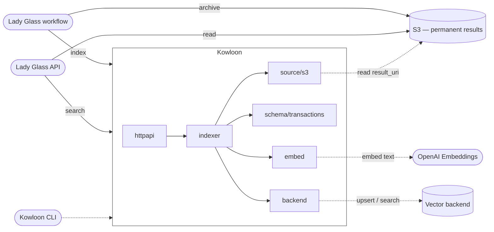

# Kowloon / 九龍

Kowloon is the vector memory controller for Lady Glass.  
Lady Glass reads documents and preserves their results. Kowloon turns those results into searchable memory.

## Why Kowloon

Lady Glass was from there. She read documents I could not.

Kowloon is the landscape of her memory.

## Architecture

Kowloon exposes a private HTTP API. Two paths on the Lady Glass side use it.

On the write side, Lady Glass archives its enriched result to a permanent S3 prefix and then hands Kowloon a URI to that archive; Kowloon reads it, embeds, and indexes.

On the read side, Lady Glass's query runtime calls Kowloon's search and resolve endpoints for candidates, then grounds the answer in the structured result on S3.



| Layer       | Owns                                                                |
| ----------- | ------------------------------------------------------------------- |
| httpapi     | routing, JSON (un)marshal, status-code mapping                      |
| indexer     | source → schema → embed → backend pipeline, with idempotency guard  |
| source      | reads archived results (S3 in v0)                                   |
| schema      | typed-result → `[]Record` conversion (`transactions.v1`, …)         |
| embed       | `EmbeddingProvider` abstraction (OpenAI `text-embedding-3-large`)   |
| cache       | embedding dedupe (memory LRU or DynamoDB behind the same interface) |
| backend     | vector store (in-memory, Qdrant, or Milvus behind the same interface) |
| idempotency | pipeline-level dedupe on (job, uri, schema, model, dim, content)    |

Kowloon never writes to the permanent bucket. Lady Glass owns the source of truth; Kowloon's index is rebuildable from it. Kowloon returns candidates; Lady Glass returns answers.

What gets embedded versus what stays in filterable metadata is specified in [docs/embedding.md](docs/embedding.md).

## API

Kowloon exposes five HTTP endpoints. Every route except `/healthz` can require an OIDC bearer token — an ES256 access token verified against the issuer's JWKS — enabled by setting `KOWLOON_OIDC_ISSUER`; with it unset Kowloon runs unauthenticated, which suits a loopback or dev deployment. Lady Glass authenticates with an Asteroid `client_credentials` token whose `aud` matches `KOWLOON_OIDC_AUDIENCE`. See [`types.go`](types.go) for the full request and response contract.

```text
POST   /v1/index-result          ingest an archived S3 result; returns the indexed count
POST   /v1/search                semantic candidates with metadata filters
POST   /v1/resolve/merchant      canonical merchant + evidence for a raw string
DELETE /v1/jobs/{job_id}         delete every record indexed under a job
GET    /healthz                  liveness probe
```

`/v1/index-result` is the primary entry point — Lady Glass calls it once the enriched result is archived on S3, and Kowloon takes care of fetching, schema conversion, embedding, and upsert.

`/v1/search` and `/v1/resolve/merchant` are the retrieval primitives Lady Glass calls during query composition; direct callers are admin or debug only. `DELETE /v1/jobs/{job_id}` is the re-index recovery handle, used when an embedding model swap requires dropping a batch.

## AWS Deploy

Kowloon is designed to run as a long-lived process on AWS.

In production, Kowloon embeds its own HTTP server and is managed by `systemd`. Lady Glass calls Kowloon over a private HTTP endpoint.

Kowloon reads archived results from S3, converts them into records, embeds them, and writes them through a configured vector backend.

```text
Lady Glass
  -> private HTTP
  -> Kowloon systemd service
  -> vector backend
```

The expected production shape is:

```
EC2 / NixOS
  systemd
    kowloon.service

  Kowloon
    HTTP API
    S3 result reader
    schema conversion
    embedding pipeline
    vector backend
```

The vector backend is selected by configuration. The primary AWS deployment uses Qdrant Cloud; a self-hosted Qdrant server also runs via `docker-compose.local.yml` for the integration loop. Milvus stays available as an alternative implementation behind the same interface.

Kowloon treats vector storage as an interface, not as an identity.

```
KOWLOON_ADDR=10.x.x.x:8080
KOWLOON_BACKEND=qdrant
KOWLOON_VECTOR_ENDPOINT=https://xxxx.cloud.qdrant.io:6333
KOWLOON_VECTOR_API_KEY=...
KOWLOON_EMBEDDING_MODEL=text-embedding-3-large
```

Kowloon also owns two DynamoDB tables for cross-restart persistence — an embedding cache and an idempotency store, provisioned by the CDK stack in `infra/cdk/`.

```
KOWLOON_CACHE=dynamodb
KOWLOON_EMBED_CACHE_TABLE=KowloonEmbeddingCache
KOWLOON_IDEMPOTENCY=dynamodb
KOWLOON_IDEMPOTENCY_TABLE=KowloonIdempotency
```

Bearer auth is off until an OIDC issuer is configured. Setting these turns on ES256 token verification on every route but `/healthz`; the JWKS URL defaults to `<issuer>/jwks.json`.

```
KOWLOON_OIDC_ISSUER=https://seven-swords.net
KOWLOON_OIDC_AUDIENCE=kowloon
# KOWLOON_OIDC_JWKS_URL=   (optional; defaults to <issuer>/jwks.json)
```

This keeps Lady Glass as the user-facing system, Kowloon as the private semantic memory service, and the vector backend as a rebuildable index backed by archived S3 results.

## Acknowledgments

Kowloon is the distant landscape of memory she shared with me.

## License

Kowloon is licensed under the MIT License.  
Copyright (c) 2026 Kei Sawamura a.k.a. Master *void  
