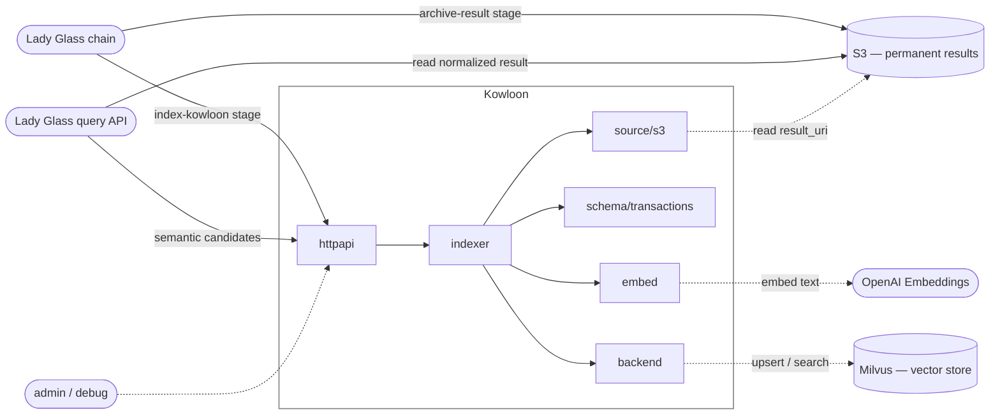

# Kowloon

Kowloon is the vector memory controller for Lady Glass.  
Lady Glass reads documents and preserves their results. Kowloon turns those results into searchable memory.

Lady Glass orchestrates. Kowloon remembers.

## Why Kowloon

Lady Glass was from there. She read documents because I could not.

Kowloon is the landscape of her memory.

## Architecture

Kowloon is called from Lady Glass as an explicit stage, not as a notification side-effect. On the write side, the chain archives its result to a permanent S3 prefix and then hands Kowloon a URI to that archive; Kowloon reads it, embeds, and indexes.

On the read side, the user's query goes to Lady Glass's query API — Kowloon's search and resolve endpoints are retrieval primitives that Lady Glass calls for candidates and then grounds in the structured result on S3. Direct access to Kowloon is reserved for admin and debug.



| Layer   | Owns                                                                |
| ------- | ------------------------------------------------------------------- |
| httpapi | routing, JSON (un)marshal, status-code mapping                      |
| indexer | source → schema → embed → backend pipeline                          |
| source  | reads archived results (S3 in v0)                                   |
| schema  | typed-result → `[]Record` conversion (`transactions.v1`, …)         |
| embed   | `EmbeddingProvider` abstraction (OpenAI `text-embedding-3-small`)   |
| backend | vector store (in-memory in v0, Milvus standalone in v1)             |

Kowloon never writes to the permanent bucket. Lady Glass owns the source of truth; Kowloon's index is rebuildable from it. Kowloon returns candidates; Lady Glass returns answers.

## API

Kowloon exposes five HTTP endpoints. v0 is unauthenticated; an `X-Api-Key` header will be added before deploy. See [`types.go`](types.go) for the full request and response contract.

```text
POST   /v1/index-result          ingest an archived S3 result; returns the indexed count
POST   /v1/search                semantic candidates with metadata filters
POST   /v1/resolve/merchant      canonical merchant + evidence for a raw string
DELETE /v1/jobs/{job_id}         drop every record indexed under a job
GET    /healthz                  liveness probe
```

`/v1/index-result` is the primary entry point — Lady Glass's `index-kowloon` stage calls it with the archived URI and Kowloon takes care of fetching, schema conversion, embedding, and upsert.

`/v1/search` and `/v1/resolve/merchant` are the retrieval primitives Lady Glass calls during query composition; direct callers are admin or debug only. `DELETE /v1/jobs/{job_id}` is the re-index recovery handle, used when an embedding model swap requires dropping a batch.
